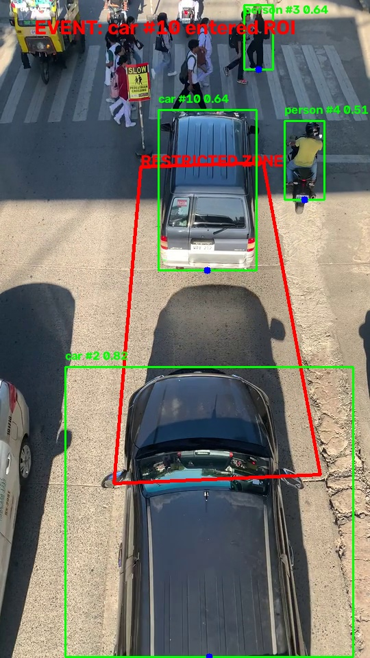

# VisionGuard AI

VisionGuard AI is an event-driven video analytics system that combines real-time computer vision with multimodal AI for automated incident detection and analysis.

The system uses YOLO26 and ByteTrack for object detection and tracking, configurable ROI-based event detection, contextual frame capture, and OpenAI vision-language analysis for structured incident assessment.



## Features

- Real-time object detection with YOLO26
- Multi-object tracking with ByteTrack
- Configurable polygon ROI monitoring
- Restricted-zone intrusion detection
- Track-based event triggering
- Clean and annotated keyframe capture
- Before/after context frame capture
- Structured event metadata saved as JSON
- OpenAI vision-language analysis
- Structured AI incident reports
- Streamlit dashboard for ROI configuration and event review

## System Pipeline

```text
Video Input
    ↓
YOLO26 Detection
    ↓
ByteTrack Tracking
    ↓
ROI Event Engine
    ↓
Event Trigger
    ↓
Context Frame Capture
    ├── before.jpg
    ├── keyframe.jpg
    ├── keyframe_annotated.jpg
    └── after.jpg
    ↓
Event Metadata
    ↓
OpenAI Vision-Language Analysis
    ↓
Structured Incident Report
```

## Project Structure

```text
visionguard-ai/
├── app/
│   └── streamlit_app.py
│
├── configs/
│   ├── bytetrack.yaml
│   └── roi.json
│
├── src/
│   ├── detector.py
│   ├── event_engine.py
│   ├── event_writer.py
│   ├── pipeline.py
│   ├── roi_selector.py
│   ├── utils.py
│   └── vlm_analyzer.py
│
├── assets/
│   └── screenshots/
│
├── README.md
├── requirements.txt
└── .gitignore
```

## Event Detection

The system monitors tracked objects relative to a user-defined polygon ROI.

An event is triggered when a tracked object's bottom-center anchor point transitions from outside the ROI to inside the ROI.

The bottom-center of the bounding box is used instead of the geometric center because it better approximates the object's contact point with the ground plane.

## Event Output

Each event is stored in its own directory:

```text
event_0001/
├── event.json
├── before.jpg
├── keyframe.jpg
├── keyframe_annotated.jpg
├── after.jpg
└── analysis.json
```

Example event metadata:

```json
{
  "event_type": "restricted_zone_intrusion",
  "track_id": 12,
  "class_id": 2,
  "class_name": "car",
  "confidence": 0.91,
  "frame_index": 143,
  "timestamp_sec": 4.77
}
```

Example AI analysis:

```json
{
  "event_valid": true,
  "description": "A vehicle moved into the configured restricted zone.",
  "visual_evidence": [
    "The vehicle is outside the monitored area in the before frame.",
    "The annotated keyframe shows the vehicle inside the ROI.",
    "The vehicle remains within the area in the after frame."
  ],
  "uncertainties": [],
  "risk_level": "medium",
  "recommended_action": "Review the event footage."
}
```

## Run the Streamlit App

Install dependencies:

```bash
pip install -r requirements.txt
```

Create a `.env` file in the project root:

```text
OPENAI_API_KEY=your_api_key_here
```

Run the application:

```bash
streamlit run app/streamlit_app.py
```

The dashboard allows users to:

- Preview the input video
- Configure or edit the ROI
- Run the full analysis pipeline
- Review detected events
- View annotated keyframes
- Inspect AI-generated incident assessments

## Command-Line Pipeline

The full pipeline can also be run directly:

```bash
python src/pipeline.py
```

## Technologies

- Python
- YOLO26
- Ultralytics
- ByteTrack
- OpenCV
- NumPy
- OpenAI API
- Pydantic
- Streamlit

## Architecture Notes

The system uses event-driven multimodal inference rather than sending every video frame to a vision-language model.

Real-time computer vision first identifies candidate events, and the VLM is invoked only when an event is triggered. This reduces unnecessary multimodal inference and keeps the architecture suitable for real-time video analytics.

The codebase is modular, with detection, event logic, event persistence, VLM analysis, and UI separated into independent components.

## Future Improvements
